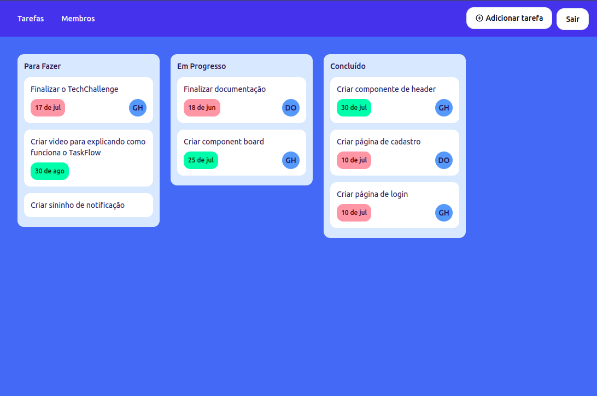

<h1 align="center">
  
</h1>

<h3 align="center">
  Aplicação de gestão de tarefas
</h3>

<p align="center">
  

  

  
</p>

<p align="center">
  
</p>

> [Visualizar live demo](https://task-flow-application.vercel.app/)

## Integrantes do Grupo M

Guilherme Henrry Batista Damasceno
guilhermehenry60@gmail.com

Douglas Soares de Oliveira
soares.douglas.oliveira@hotmail.com

## Sobre

software TaskFlow é uma aplicação web projetada para a gestão eficiente de times e tarefas. Seu objetivo é oferecer uma plataforma intuitiva e eficaz para a atribuição e monitoramento de atividades dentro de equipes.

## Video do funcionamento da aplicação

https://www.loom.com/share/43a9ea6459c54e11b869cf4e0c9aec04?sid=3d9dda39-cbef-46e4-9414-c7a1f6ac0972

## Como utilizar

Primeiro passo é clonar esse repositório

```bash
git clone https://github.com/Guihenrry/TaskFlow.git
```

Este repositório contém aplicação backend, frontend. Por isso separei o processo de instalação para cada ambiente.

- [backend](https://github.com/Guihenrry/TaskFlow/blob/main/backend/README.md)
- [frontend](https://github.com/Guihenrry/TaskFlow/blob/main/frontend/README.md)

## Repositório do GitHub

Você pode encontrar o código-fonte e os arquivos relacionados a este projeto no seguinte repositório do GitHub:

https://github.com/Guihenrry/TaskFlow
